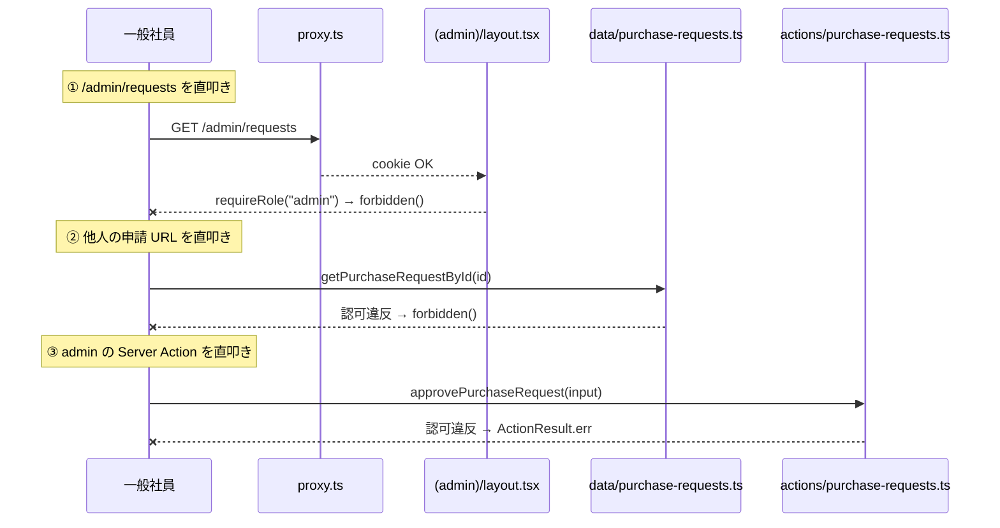

# アーキテクチャ

Repository や Aggregate のような重い抽象は入れず、認可・状態遷移・楽観ロックといった「実装で効くポイント」を Server Action と schema と tests に直接書いています。コードを薄く保つことで、設計判断がそのまま読めることを意図しました。

## 再現性を最優先にしたセットアップ設計

「clone した人が誰でもすぐ動かせる」を最優先に置きました。具体的には:

- **Docker / docker-compose 不要** — コンテナランタイムが入っていない PC でも動くように、DB は SQLite ファイル (`db/local/local.db`) をローカルに自動生成する構成にしました
- **外部サービス不要** — Supabase / Firebase / PostgreSQL サーバ / Redis などへの接続は一切ありません。アカウント作成や認証情報のセットアップが要らないので、課題の文脈で誰がいつ clone しても同じ状態から始められます
- **`.env` 不要** — `DATABASE_URL` を含め、起動に必要な環境変数はゼロです (`db/local/local.db` をフォールバック先にしているため)
- **1 コマンドで DB 投入** — `npm run setup` だけで「DB ファイル削除 → migrate → seed」が走り、申請 100 件 + 履歴を含む状態で起動できます

結果として、`git clone` → `npm install` → `npm run setup` → `npm run dev` の **3 コマンド**で動作確認まで到達できます。`「git clone → READMEの手順通りにセットアップ → 動く」が成立しない場合は減点` という採点基準を踏まえて、本番運用での選択肢 (PostgreSQL 等) よりも、まず動くことを優先しました。本番運用に乗せる際は `DATABASE_URL` を libSQL 互換のホスト (Turso 等) に向けるだけで切り替えられる前提です。

## 技術スタックと選定理由

| 採用 | 用途と選定理由 |
|---|---|
| Next.js 16 (App Router) + React 19 | レンダリング方式や Server Action の挙動を理解しており、フルスタックアプリの構築で最も手早く形にできる構成だと判断したためです |
| Mantine 9 + mantine-datatable v8 | UI コンポーネントの種類が豊富かつ API が扱いやすく、業務アプリケーションに向いた UI 表現が揃っていると判断したためです |
| nuqs v2 | フィルタ・ソート・検索・ページネーションを `useQueryStates` 1 個で URL 同期でき、`useState` が増えがちな一覧画面の状態管理を 1 か所にまとめられるためです |
| Drizzle ORM + libSQL (SQLite ファイル) | 外部サービス不要・`.env` 不要で、`npm run setup` 1 発でセットアップから起動まで到達できるためです |
| `@holiday-jp/holiday_jp` | 日付入力で祝日強調を行う最小依存のために採用しました |
| Biome / Vitest 4 / Playwright | lint・format を 1 ツールに集約し、テストは unit / schema / component / E2E の 4 段で必要分だけ書くためです |

ライトモード固定 (`forceColorScheme="light"`)。時刻は `dayjs.tz.setDefault("Asia/Tokyo")` を経由するため、実行環境の TZ に依存しません。

## 薄い 3 層

| 層 | 場所 | 役割 |
|---|---|---|
| 純粋関数 | `app/lib/` | 状態遷移 / 認可 helper / errors / format。単独でテスト可能 |
| 読み込み | `app/server/data/` | `cache()` + `'server-only'` + 認可。Server Component から直接呼ぶ |
| 書き込み | `app/server/actions/` | `'use server'` + `withActionResult` + transaction + 楽観ロック |

## 認可は 3 段で守る

URL を直接叩いても、Server Action を直接呼んでも、他人の申請には届きません。

| 段 | 場所 | チェック |
|---|---|---|
| 1 | `proxy.ts` | cookie に `user_id` がなければ `/` redirect |
| 2 | `app/(role)/layout.tsx` | `requireRole("employee" \| "admin")`、違えば `forbidden()` |
| 3-a | `app/server/data/*` (読み込み) | `requireSession` + 認可、その場で `notFound()` / `forbidden()` を呼ぶ |
| 3-b | `app/server/actions/*` (書き込み) | `requireSession` + 認可、`BusinessError` を throw して `withActionResult` で整形 |



操作別の認可 helper は `app/lib/auth.ts` にまとめてあります:

```ts
canViewPurchaseRequest(viewer, ownerUserId)     // 本人 or admin
canEditPurchaseRequest(viewer, ownerUserId)     // employee で本人だけ
canWithdrawPurchaseRequest(viewer, ownerUserId) // employee で本人だけ
canReviewPurchaseRequest(viewer)                // admin だけ
```

承認者は申請内容を編集・取り下げできません。「承認する側が自分で申請して自分で承認する」状況を helper レベルで防いでいます。

## Server Component と Client Component の境界

App Router のデフォルトは Server Component で、`"use client"` を付けたファイルだけが Client Component になります。本アプリでは 28 ファイルに `"use client"` を付けていて、それ以外 (page / layout / data 層 / 静的なコンポーネント) は Server で動きます。

| 区分 | 役割 | 例 |
|---|---|---|
| Server (デフォルト) | データ取得・認可・初期描画 | `(employee)/requests/page.tsx` / `app/server/data/*` / `PurchaseRequestDetail` (静的部分) |
| Client (`"use client"`) | フォーム / Modal / インタラクション / nuqs / Mantine の interactive UI | `purchase-request-form.tsx` / `*-modal.tsx` / `*-sidebar.tsx` / `app-shell-layout.tsx` |

判断基準は「ユーザー操作で state が変わるか / browser API が必要か」です。例えば `PurchaseRequestDetail` はデータ表示だけなので Server、`AdminPurchaseRequestActions` は Modal の開閉 state を持つので Client です。

Server から Client に props を渡すときは関数やクラスインスタンスをそのまま渡せない (serialize 不可) ので、`AppShellLayout` のように Context 経由でハンドラを届けています。

## `cache()` で同一リクエスト内の重複呼び出しを排除

データ取得関数を `React.cache()` でラップしているので、同じリクエスト内で何度呼んでも DB ヒットは 1 回です。

```ts
export const getPurchaseRequestById = cache(async (id) => { ... });
export const getSession = cache(async () => { ... });
export const listCategories = cache(async () => { ... });
```

例えば `getSession` は `proxy.ts` 配下の middleware / `requireRole` / data 層の認可で何度も呼ばれますが、cache のおかげで実 DB アクセスは 1 リクエストにつき 1 回です。`listApprovalHistoriesForPurchaseRequest` の内部で `getPurchaseRequestById` を呼んで親リソースの可視性を継承するパターンも、cache が効くため重複アクセスは起きません。

## エラーの流し方

| 経路 | 動き |
|---|---|
| 書き込み (Server Action) | `BusinessError` を投げると `withActionResult` が `ActionResult<T>` に整形して Client に返す |
| 読み込み (Server Component) | data 層がその場で `notFound()` / `forbidden()` を呼ぶ。page 側に try-catch は不要 |
| Client | `result.error.kind` で分岐。`CONFLICT` は通知 + `router.refresh()`、`VALIDATION` の `fieldErrors` は `form.setErrors()` に展開 |

「とりあえず catch して握りつぶす」をやらないよう、`BusinessError` の `kind` 分岐で経路を明示しています。

## 楽観ロック

複数の admin が同時に承認/却下を投げても壊れないように、`WHERE status='pending'` 付きの UPDATE で「先勝ち」を強制しています。

```sql
UPDATE purchase_requests
SET status = 'approved'
WHERE id = ? AND status = 'pending'
RETURNING id;
```

0 件返ったら `ConflictError`。Client 側は通知 + `router.refresh()` で画面を最新に揃えます。

`tests/actions/approve-twice.test.ts` で in-memory DB に対して実 SQL を流して挙動を検証しています (mock しない)。

## 妥協した点・もっと時間があればやりたかったこと

### ドメイン層を独立させたクリーンアーキテクチャの導入

本アプリでは「純粋関数 (`app/lib/`) / 読み込み (`app/server/data/`) / 書き込み (`app/server/actions/`)」の薄い 3 層に留めました。本格的な業務システムであれば Domain (Entity / Value Object / Domain Service) / UseCase / Repository / Infrastructure に分割し、Server Action はユースケースの呼び出しに徹する形にしたいです。`PurchaseRequest` を集約として扱い、状態遷移や認可をエンティティのメソッドに閉じ込めれば、ビジネスルールがより目に見える形になります。今回はコードの薄さで設計判断を表現することを優先したため、その手前で止めました。

### Suspense + loading.tsx による段階的描画

Next.js の `<Suspense>` と `loading.tsx` でデータ取得中の skeleton を出す構成も検討しましたが、本アプリは local の SQLite ファイルを直接読むため、データ取得が体感ゼロ秒で完了します。`Suspense` を入れると skeleton が一瞬出てすぐ消える「ポップコーン UI」になり、むしろ UX が落ちると判断したため、今回は採用していません。代わりにページ全体に `<FadeIn>` を当てて、コンテンツが滑らかに立ち上がる挙動でつなげています。本番で外部 DB やネットワーク越しの API を使う構成になった時に、データ単位の `Suspense` + skeleton に切り替える想定です。

### コンポーネント内ロジックのカスタムフックへの切り出し

`PurchaseRequestForm` の submit ハンドラや、admin 側のカテゴリ CRUD コンポーネントには「Server Action 呼び出し → 結果分岐 → 通知 → `router.refresh()`」というパターンが集まっています。実装途中で `useSubmitPurchaseRequest` / `useChildCategoryCRUD` / `useParentCategoryCRUD` として hooks に切り出すリファクタを試しましたが、「同じ hook が 1 か所からしか呼ばれない = 再利用性ゼロ」「component 内で読めば全部わかる colocated logic の方が読み手に優しい」というトレードオフを優先して破棄しました。再利用箇所が増えるか、テスト対象として独立させたい局面が来たら hook 化する方向に切り替える想定です。

### 多段階承認 / 金額閾値による承認ルート分岐 / 添付ファイル / 申請理由テキスト / 購入希望商品のリンク

業務システムとしては自然な拡張ですが、状態遷移と認可が一段複雑になるため今回は採用していません。多段階承認は `approval_histories` を「次の承認者を誰にするか」の駆動データとして使う設計に発展させたかったところです。購入希望商品の URL を持たせれば、承認者が実際の商品ページを確認しながら判断できるようになります。

### オブザーバビリティ (構造化ログ + エラー追跡)

`pino` で構造化ログを出して `correlation ID` を Server Action 呼び出し単位で発行し、Sentry / OpenTelemetry で本番のクライアントエラー・サーバエラー・トレースを収集したいです。今回は `withActionResult` 内の `console.error` で最小限のログだけ出しています。

### コンポーネントテストの網羅 / E2E シナリオの追加

UI 深掘りの代表として `StatusBadge` の smoke 1 本と E2E 2 本 (承認パス / 却下パス) で間接的に担保していますが、編集・取り下げ・カテゴリ CRUD のシナリオも E2E に加えたかったです。状態遷移・認可・楽観ロックは unit でカバー済みなので回帰の検出はできますが、ブラウザ越しの動線確認には及びません。

## 作業時間の内訳

合計 **約 5 時間** (休憩除く)。最初のコミットが 2026-05-11 17:12、最後が翌 00:25 で経過 7 時間 13 分ですが、20:19〜23:25 の 3 時間は食事・中断で抜けています。

| フェーズ | 内容 | 目安 |
|---|---|---|
| 1 | 環境構築 / DB / SSoT / lib | 50min |
| 2 | データ参照層 / Server Action / proxy.ts | 50min |
| 3 | 共通 UI / ログイン画面 | 30min |
| 4 | 一般社員の動線 (一覧 / 詳細 / 新規申請 / Combobox) | 60min |
| 5 | 管理者の動線 (全申請 / 承認・却下 Modal / 競合 UX) | 50min |
| 6 | 編集・取り下げ機能 / カテゴリ管理 | 40min |
| 7 | エラーページ / リファクタ | 20min |
| 8 | E2E / README・docs | 30min |
