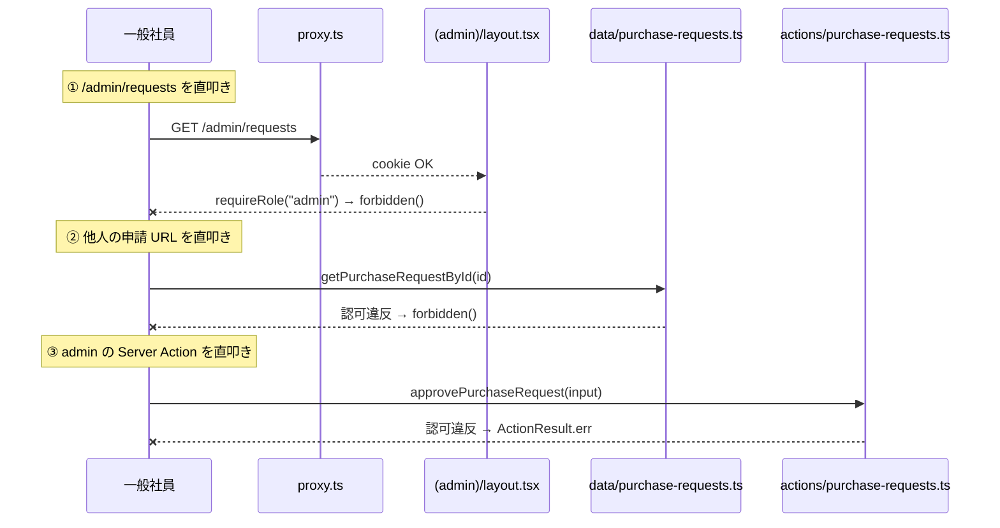

# アーキテクチャ

Repository や Aggregate のような重い抽象は入れず、認可・状態遷移・楽観ロックといった「実装で効くポイント」を Server Action と schema と tests に直接書いています。コードを薄く保つことで、設計判断がそのまま読めることを意図しました。

## 薄い 3 層

| 層 | 場所 | 役割 |
|---|---|---|
| 純粋関数 | `app/lib/` | 状態遷移 / 認可 helper / errors / format。単独でテスト可能 |
| 読み込み | `app/server/data/` | `cache()` + `'server-only'` + 認可。Server Component から直接呼ぶ |
| 書き込み | `app/server/actions/` | `'use server'` + `withActionResult` + transaction + 楽観ロック |

## 認可は 3 段で守る

URL を直接叩いても、Server Action を直接呼んでも、他人の申請には届きません。

| 段 | 場所 | チェック |
|---|---|---|
| 1 | `proxy.ts` | cookie に `user_id` がなければ `/` redirect |
| 2 | `app/(role)/layout.tsx` | `requireRole("employee" \| "admin")`、違えば `forbidden()` |
| 3-a | `app/server/data/*` (読み込み) | `requireSession` + 認可、その場で `notFound()` / `forbidden()` を呼ぶ |
| 3-b | `app/server/actions/*` (書き込み) | `requireSession` + 認可、`BusinessError` を throw して `withActionResult` で整形 |



操作別の認可 helper は `app/lib/auth.ts` にまとめてあります:

```ts
canViewPurchaseRequest(viewer, ownerUserId)     // 本人 or admin
canEditPurchaseRequest(viewer, ownerUserId)     // employee で本人だけ
canWithdrawPurchaseRequest(viewer, ownerUserId) // employee で本人だけ
canReviewPurchaseRequest(viewer)                // admin だけ
```

承認者は申請内容を編集・取り下げできません。「承認する側が自分で申請して自分で承認する」状況を helper レベルで防いでいます。

## エラーの流し方

| 経路 | 動き |
|---|---|
| 書き込み (Server Action) | `BusinessError` を投げると `withActionResult` が `ActionResult<T>` に整形して Client に返す |
| 読み込み (Server Component) | data 層がその場で `notFound()` / `forbidden()` を呼ぶ。page 側に try-catch は不要 |
| Client | `result.error.kind` で分岐。`CONFLICT` は通知 + `router.refresh()`、`VALIDATION` の `fieldErrors` は `form.setErrors()` に展開 |

「とりあえず catch して握りつぶす」をやらないよう、`BusinessError` の `kind` 分岐で経路を明示しています。

## 楽観ロック

複数の admin が同時に承認/却下を投げても壊れないように、`WHERE status='pending'` 付きの UPDATE で「先勝ち」を強制しています。

```sql
UPDATE purchase_requests
SET status = 'approved'
WHERE id = ? AND status = 'pending'
RETURNING id;
```

0 件返ったら `ConflictError`。Client 側は通知 + `router.refresh()` で画面を最新に揃えます。

`tests/actions/approve-twice.test.ts` で in-memory DB に対して実 SQL を流して挙動を検証しています (mock しない)。

## Server↔Client 境界で踏んだ罠

Mantine + Next.js 16 + React 19 で出会った落とし穴のメモ。

| 罠 | 対処 |
|---|---|
| Mantine の compound component を含むラッパーを Server で書く → server bundle で `Element type is invalid` | ラッパーに `"use client"` を付ける |
| Modal Form で HTML5 `required` を使う → ブラウザの validation が submit を止めて Mantine `useForm.validate` が走らない | `withAsterisk` (見た目だけ) に置き換える |
| Server から Client に関数 props を渡す → serialize 不可エラー | `ReactNode` で受ける / Context 経由 |
| Mantine polymorphic `component={Link}` を Server で渡す | `<Link><Button component="span">...</Button></Link>` で外側 Link、内側 Button が span |

## 作業時間の内訳

合計 **約 5 時間** (休憩除く)。最初のコミットが 2026-05-11 17:12、最後が翌 00:25 で経過 7 時間 13 分ですが、20:19〜23:25 の 3 時間は晩飯・中断で抜けています。

| フェーズ | 内容 | 目安 |
|---|---|---|
| 1 | 環境構築 / DB / SSoT / lib | 50min |
| 2 | データ参照層 / Server Action / proxy.ts | 50min |
| 3 | 共通 UI / ログイン画面 | 30min |
| 4 | 一般社員の動線 (一覧 / 詳細 / 新規申請 / Combobox) | 60min |
| 5 | 管理者の動線 (全申請 / 承認・却下 Modal / 競合 UX) | 50min |
| 6 | 編集・取り下げ機能 / カテゴリ管理 | 40min |
| 7 | エラーページ / リファクタ | 20min |
| 8 | E2E / README・docs | 30min |
