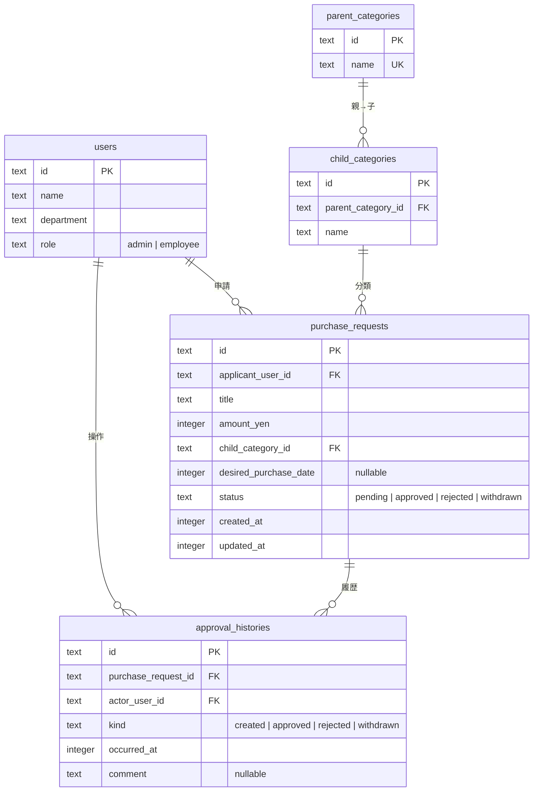
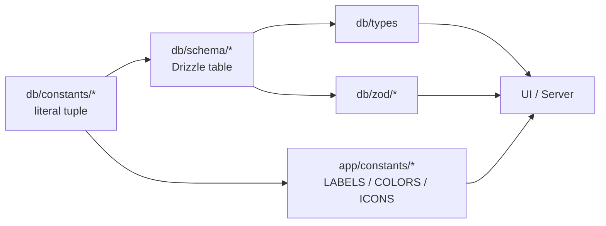

# データモデル

5 テーブル。SQLite + Drizzle ORM で、`db/local/local.db` にファイル保存します。

## ER 図



## onDelete で業務ルールを表現する

「消してよいもの」と「消すと困るもの」を FK の `onDelete` でスキーマに刻んでいます。

| 関係 | 設定 | 理由 |
|---|---|---|
| `purchase_requests → users` | restrict | 申請者を消しても申請は残す (業務監査) |
| `approval_histories → users` | restrict | 操作者を消しても監査履歴は残す |
| `purchase_requests → child_categories` | restrict | カテゴリ削除で過去申請の参照を壊さない |
| `child_categories → parent_categories` | restrict | 子が残っている親は消させない |
| `approval_histories → purchase_requests` | cascade | 申請本体を消したら関連履歴も一緒に消す |

`approval_histories` だけ共通の `timestamps` を持たず、`occurredAt` がイベント発生時刻を表す **追加のみ (append-only)** の設計です。

## 状態遷移

```
申請中 ─→ 承認済    (admin が承認)
申請中 ─→ 却下      (admin が却下)
申請中 ─→ 取り下げ  (employee が取り下げ)
```

確定状態 (承認済 / 却下 / 取り下げ) からは戻りません。`canTransitionPurchaseRequestStatus` を 4×4 = 16 ケースの真理値表でテストして、上の 3 経路だけ true にしています。

## なぜ親カテゴリ ID を保存しないか

申請が指すのは **子カテゴリだけ**で、親は子から JOIN で導出します。

| 選択肢 | メリット | デメリット |
|---|---|---|
| 親 + 子 両方保存 | 親フィルタが速い | 「親=ソフト / 子=モニター」の不整合が作れてしまう |
| **子だけ保存** ← 採用 | 不整合がスキーマ上ありえない | 親が欲しい時に JOIN |

矛盾した組み合わせを物理的に排除する判断です。

## SSoT から派生させる



enum を 1 つ足すと、型・zod・UI ラベル・色・アイコンの全部に tsc が反応します。

## Seed の中身

`npm run setup` で投入される量:

- users 4 (admin 1 + 一般社員 3)
- parent_categories 4 / child_categories 11
- purchase_requests 100 件 (申請中・承認済・却下・取り下げ が混ざる)
- approval_histories は申請ごとに「申請」イベント、確定済みなら「決裁」または「取り下げ」イベントを追加

申請日 (`created_at`) は過去 90 日に分散、希望購入日は半数だけに設定しています (NULLABLE 検証も兼ねる)。
